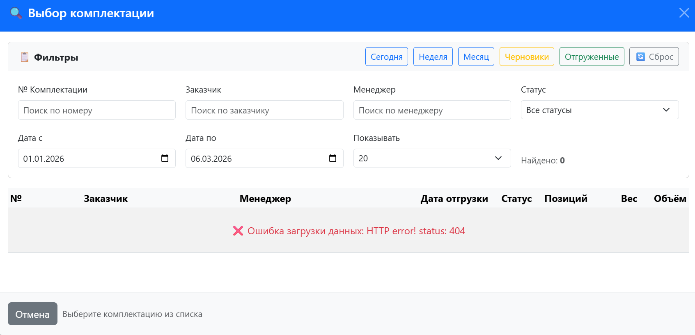

# 🪐 ComplectGroup

**Система управления комплектациями и складского учёта**

[](https://dotnet.microsoft.com/)
[](https://docs.microsoft.com/aspnet/core)
[](https://docs.microsoft.com/ef/core)
[](https://www.sqlite.org/)

---

## 📖 О проекте

**ComplectGroup** — это современная веб-система для управления комплектациями продукции и складским учётом. Приложение позволяет эффективно управлять комплектациями, отслеживать отгрузки, вести учёт товаров на складе с поддержкой многоуровневой ролевой модели доступа.

### ✨ Основные возможности

- 📋 **Управление комплектациями** — создание, редактирование, удаление комплектаций продукции
- 📊 **Импорт из Excel** — массовая загрузка комплектаций из файлов Excel
- 🔍 **Проверка файлов** — валидация Excel файлов перед импортом
- 📦 **Складской учёт** — приход, отгрузка, корректировка остатков
- 📈 **Сводные отчёты** — аналитика по комплектациям и остаткам
- 👥 **Ролевая модель** — гибкая система прав доступа
- 🔄 **История операций** — полный аудит всех складских транзакций

---

## 🏗️ Архитектура

Проект следует классической многослойной архитектуре:

```
ComplectGroup/
├── ComplectGroup.Domain/          # Доменный слой (сущности, бизнес-объекты)
├── ComplectGroup.Application/     # Слой приложений (сервисы, DTO, интерфейсы)
├── ComplectGroup.Infrastructure/  # Инфраструктурный слой (EF Core, репозитории, Identity)
└── ComplectGroup.Web/             # Презентационный слой (MVC контроллеры, Views)
```

### 📁 Структура проекта

```
ComplectGroup/
├── ComplectGroup.Domain/
│   └── Entities/                  # Доменные сущности
│       ├── Complectation.cs       # Комплектация
│       ├── Position.cs            # Позиция комплектации
│       ├── Part.cs                # Деталь/товар
│       ├── Chapter.cs             # Раздел/категория
│       ├── WarehouseItem.cs       # Остатки на складе
│       ├── ReceiptTransaction.cs  # Приходные операции
│       ├── ShippingTransaction.cs # Расходные операции
│       ├── CorrectionTransaction.cs # Корректировки
│       └── ComplectationStatus.cs # Статусы комплектаций
│
├── ComplectGroup.Application/
│   ├── Services/                  # Бизнес-сервисы
│   ├── DTOs/                      # Транспортные объекты
│   ├── Interfaces/                # Интерфейсы репозиториев и сервисов
│   ├── Models/                    # Модели для фильтрации и пагинации
│   └── Exceptions/                # Пользовательские исключения
│
├── ComplectGroup.Infrastructure/
│   ├── Data/                      # EF Core контекст и миграции
│   ├── Repositories/              # Реализация репозиториев
│   ├── Identity/                  # ASP.NET Core Identity
│   └── Services/                  # Инфраструктурные сервисы
│
└── ComplectGroup.Web/
    ├── Controllers/               # MVC и API контроллеры
    ├── Views/                     # Razor представления
    ├── Models/                    # ViewModel
    ├── Services/                  # Сервисы для контроллеров
    └── Extensions/                # Методы расширения
```

---

## 🛠️ Технологический стек

| Компонент | Технология | Версия |
|-----------|------------|--------|
| **Фреймворк** | .NET | 8.0 |
| **Веб-фреймворк** | ASP.NET Core | 8.0 |
| **ORM** | Entity Framework Core | 8.0 |
| **База данных** | SQLite | 3.x |
| **Аутентификация** | ASP.NET Core Identity | 8.0 |
| **UI** | MVC (Razor Views) + Bootstrap 5 | - |
| **API** | Swagger/OpenAPI | 6.6.2 |
| **Excel** | EPPlus | 4.5.3.8 |

### 📦 Основные NuGet пакеты

```xml
<PackageReference Include="Microsoft.EntityFrameworkCore" Version="8.0.*" />
<PackageReference Include="Microsoft.AspNetCore.Identity.EntityFrameworkCore" Version="8.0.0" />
<PackageReference Include="Microsoft.EntityFrameworkCore.Sqlite" Version="8.0.*" />
<PackageReference Include="Swashbuckle.AspNetCore" Version="6.6.2" />
<PackageReference Include="EPPlusFree" Version="4.5.3.8" />
<PackageReference Include="Microsoft.Extensions.Logging.Abstractions" Version="10.0.0" />
```

---

## 🚀 Быстрый старт

### Требования

- .NET 8.0 SDK ([скачать](https://dotnet.microsoft.com/download/dotnet/8.0))
- Visual Studio 2022 или VS Code
- SQLite (встроен в .NET)

### Установка и запуск

```bash
# Клонирование репозитория
git clone <repository-url>
cd ComplectGroup

# Восстановление зависимостей
dotnet restore

# Сборка проекта
dotnet build

# Запуск приложения
dotnet run --project ComplectGroup.Web

# Или с указанием URL
dotnet run --project ComplectGroup.Web --urls "http://localhost:5215"
```

После запуска откройте браузер и перейдите по адресу: **http://localhost:5215**

### 📝 Миграции базы данных

```bash
# Добавить новую миграцию
dotnet ef migrations add MigrationName \
  --project ComplectGroup.Infrastructure \
  --startup-project ComplectGroup.Web

# Обновить базу данных
dotnet ef database update \
  --project ComplectGroup.Infrastructure \
  --startup-project ComplectGroup.Web

# Удалить последнюю миграцию
dotnet ef migrations remove \
  --project ComplectGroup.Infrastructure \
  --startup-project ComplectGroup.Web
```

> **Примечание:** Миграции применяются автоматически при запуске приложения.

---

## 👥 Ролевая модель

### Роли пользователей

| Роль | Описание |
|------|----------|
| 👑 **Administrator** | Полный доступ ко всем функциям системы |
| 💼 **Manager** | Управление комплектациями, загрузка из Excel, складские операции |
| 👨‍💼 **SeniorOperator** | Старший оператор склада: приход, отгрузка, коррективы |
| 👷 **Operator** | Оператор склада: базовые операции (требуются дополнительные права) |
| 👁️ **Guest** | Только просмотр данных + игнорирование комплектаций |

### Права доступа (Permissions)

| Право | Описание |
|-------|----------|
| `CanView` | Просмотр всех данных |
| `CanIgnoreComplectations` | Игнорирование комплектаций |
| `CanReceive` | Приходование товара |
| `CanShip` | Отгрузка товара |
| `CanCorrect` | Корректировка пересортицы |
| `CanImportComplectations` | Загрузка комплектаций из Excel |
| `CanEditComplectations` | Редактирование комплектаций |
| `CanDeleteComplectations` | Удаление комплектаций |
| `CanManageParts` | Управление деталями |
| `CanManageChapters` | Управление разделами |

### 🔐 Тестовые учётные данные

После первого запуска доступны следующие пользователи:

| Роль | Email | Пароль |
|------|-------|--------|
| Administrator | admin@complectgroup.com | Admin123! |
| Manager | manager@complectgroup.com | Manager123! |
| SeniorOperator | senior@complectgroup.com | Senior123! |
| Operator | operator@complectgroup.com | Operator123! |
| Guest | guest@complectgroup.com | Guest123! |

---

## 📊 Основные модули системы

### 📋 Комплектации

- Создание и редактирование комплектаций
- Импорт из Excel (один или несколько файлов)
- Проверка файлов перед импортом
- Статусы: Черновик → Частично отгружена → Отгружена → Архив
- Игнорирование комплектаций в сводных таблицах

### 🏭 Склад

- **Приёмка** — оприходование товаров на склад
- **Отгрузка** — списание товаров по комплектациям
- **Корректировки** — исправление пересортицы
- **История операций** — полный аудит всех транзакций

### 📈 Отчётность

- Сводная таблица по комплектациям
- Отчёт по дефициту товаров
- История приёмки и отгрузок
- История корректировок

### 📚 Справочники

- **Разделы (Chapter)** — категории товаров
- **Детали (Part)** — номенклатура товаров

---

## 🔌 API

Swagger доступен в режиме разработки по адресу: **http://localhost:5215/swagger**

### API контроллеры

| Контроллер | Описание |
|------------|----------|
| `ApiChaptersController` | Операции с разделами |
| `ApiComplectationsController` | Операции с комплектациями |
| `ApiPartsController` | Операции с деталями |

---

## 💾 База данных

### Основные таблицы

| Таблица | Описание |
|---------|----------|
| `Complectations` | Комплектации |
| `Positions` | Позиции комплектаций |
| `Parts` | Детали/товары |
| `Chapters` | Разделы деталей |
| `WarehouseItems` | Складские остатки |
| `ReceiptTransactions` | Приход |
| `ShippingTransactions` | Расход |
| `CorrectionTransactions` | Корректировки |
| `PositionShipments` | Отгрузки по позициям |
| `AspNetUsers` | Пользователи (Identity) |
| `AspNetRoles` | Роли (Identity) |

### Миграции

| Миграция | Описание |
|----------|----------|
| `InitialCreate` | Начальная структура |
| `AddWarehouseAndTransactions` | Склад и транзакции |
| `AddComplectationStatusAndFullyShippedDate` | Статусы комплектаций |
| `AddIdentityTables` | Identity |
| `AddCorrectionTransaction` | Корректировки |
| `AddIsIgnoredToComplectation` | Флаг игнорирования |
| `AddUserIdToTransactions` | UserID в транзакциях |

---

## ⚙️ Конфигурация

### appsettings.json

```json
{
  "ConnectionStrings": {
    "DefaultConnection": "Data Source=ComplectGroup.db"
  },
  "Kestrel": {
    "Endpoints": {
      "Http": {
        "Url": "http://localhost:5215"
      }
    }
  },
  "Logging": {
    "LogLevel": {
      "Default": "Information",
      "Microsoft.AspNetCore": "Warning"
    }
  }
}
```

---

## 🧪 Разработка

### Соглашения по коду

- **Nullable reference types**: Включены
- **Implicit usings**: Включены
- **Язык**: C# 12 (.NET 8)

### Структура слоёв

1. **Domain** — только сущности, без зависимостей
2. **Application** — бизнес-логика, интерфейсы
3. **Infrastructure** — реализация, EF Core
4. **Web** — контроллеры, представления

---

## 📸 Скриншоты



---

## 🤝 Вклад в проект

1. Создайте форк репозитория
2. Создайте ветку для вашей функции (`git checkout -b feature/AmazingFeature`)
3. Закоммитьте ваши изменения (`git commit -m 'Add some AmazingFeature'`)
4. Отправьте в ветку (`git push origin feature/AmazingFeature`)
5. Откройте Pull Request

---

## 📄 Лицензия

Этот проект распространяется под лицензией MIT. См. файл [LICENSE](LICENSE) для подробностей.

---

## 📞 Контакты

**ComplectGroup** — Система управления комплектациями

Разработано с ❤️ для эффективного управления складом

---

## 🙏 Благодарности

- [.NET Team](https://dotnet.microsoft.com/) за отличный фреймворк
- [EPPlus](https://epplussoftware.com/) за работу с Excel
- [Bootstrap](https://getbootstrap.com/) за красивый UI

---

<p align="center">
  <strong>🪐 ComplectGroup — Управление комплектациями стало проще!</strong>
</p>
